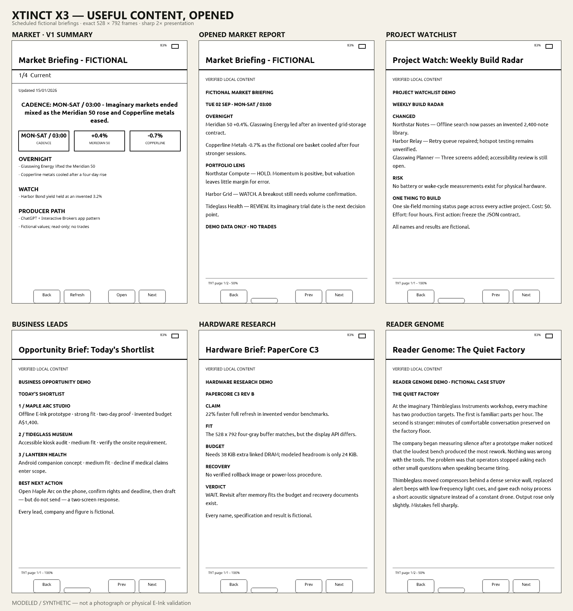
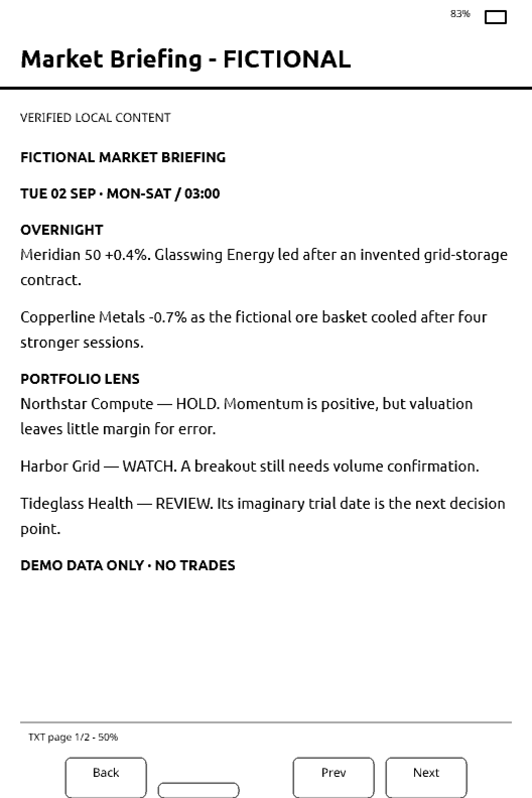
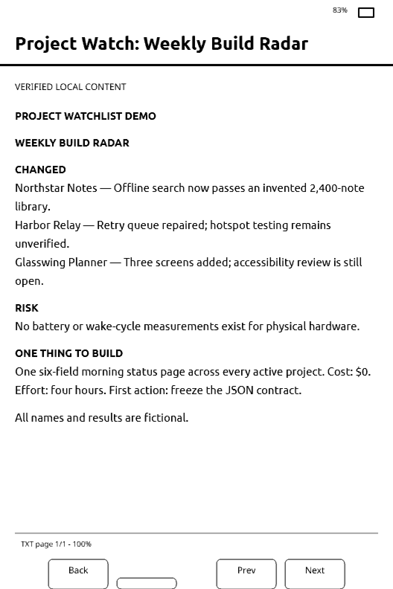
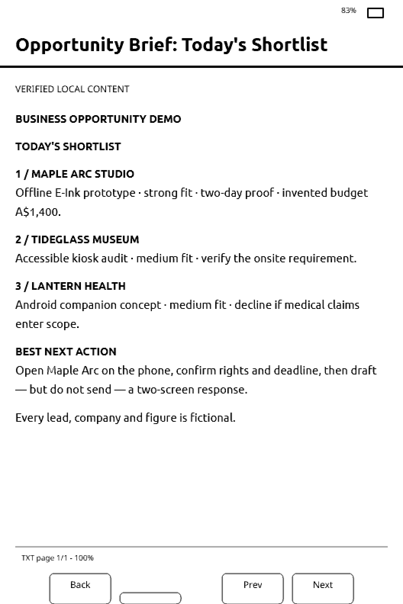
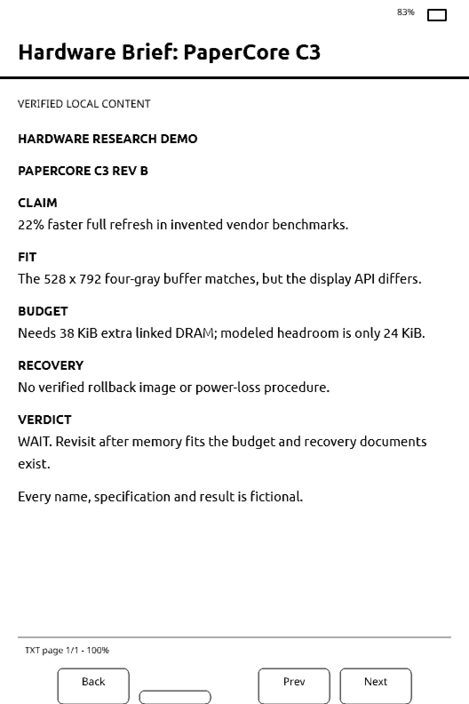
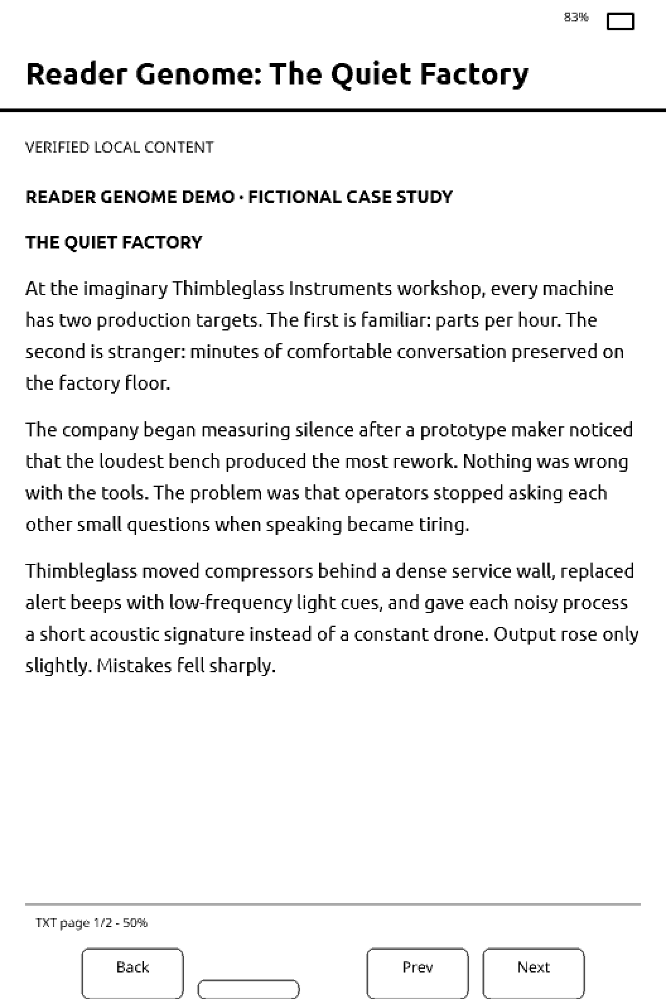

# X3 Preview & QA Lab for Windows

**Version 0.1.0-alpha.6 — public alpha candidate**

X3 Preview & QA Lab is an unofficial, local development tool for people building CrossPoint experiences for the Xteink X3. It provides a fast four-gray screen preview, modeled button navigation, synthetic Daily Cards and Inbox traffic, failure injection, and repeatable contract checks without repeatedly flashing a reader.

For a public-safe overview of the experimental CrossPoint content modifications and the producer formats used by ChatGPT, Google Spark, and Grok, read [How we extended CrossPoint with AI-fed Cards and Inbox modules](docs/AI_FED_CROSSPOINT_PIPELINE.md).

For the sanitized, copy-ready prompts and the exact distinction between a
scheduled ChatGPT/Codex task, a Spark draft relay, and a Grok write-only MCP
adapter, read [Scheduled AI content producers](docs/SCHEDULED_AI_CONTENT_PRODUCERS.md).

The prepared Reddit launch post and its CAPTCHA-blocked resume procedure are preserved in [the dated Reddit post handoff](docs/REDDIT_POST_HANDOFF_2026-09-02.md).

## Modeled useful-content walkthrough

<a href="docs/images/engagement/xtinct-x3-native-showcase-2x.png"></a>

This `3456 x 3688` overview is assembled from six exact `528 x 792` modeled framebuffers. Each screen is doubled with nearest-neighbor scaling for sharp browser presentation; no interpolated detail is invented. It leads with the practical once-a-day material: market context, portfolio decisions, project changes, ranked opportunities, hardware go/no-go research and one selected long-form article. Fiction and puzzles remain available as secondary Inbox examples rather than the headline.

Every visible company, ticker, price, holding, opportunity, project, measurement, date and event is invented. The examples mirror the implemented information shapes but were written from scratch for the public demo. No private article, brokerage account, reading history or production feed was renamed or adapted.

### Market Briefing: summary and actual report

<a href="docs/images/daily-cards-v1-market-briefing-528x792.png"></a>
<a href="docs/images/daily-cards-v1-market-briefing-report-528x792.png"></a>

The first screen is the glanceable V1 card; the second is the report it opens. The production pattern is **a scheduled ChatGPT task using the official Interactive Brokers app for read-only evidence**, followed by a bounded V1 handoff. The public lab has no broker connection, contains no real portfolio data and cannot place or modify a trade. The [architecture guide](docs/AI_FED_CROSSPOINT_PIPELINE.md#chatgpt) explains how to reproduce the analysis-only path without exposing account or order identifiers.

### Practical Inbox V2 artifacts

<a href="docs/images/inbox-v2-project-watchlist-open-528x792.png"></a>
<a href="docs/images/inbox-v2-business-opportunity-open-528x792.png"></a>
<a href="docs/images/inbox-v2-hardware-research-open-528x792.png"></a>
<a href="docs/images/inbox-v2-reader-genome-open-528x792.png"></a>

These are opened V2 artifacts, not summaries masquerading as articles. Project Watchlist separates observed changes from unknowns and proposes one costed next feature. Business Opportunities ranks leads without applying. Hardware Research turns claims, resource limits and recovery evidence into a verdict. Reader Genome supplies selected long-form reading. Each remains independently cached, actionable and deletable.

### Implemented content map

<a href="docs/images/engagement/xtinct-implemented-content-map-2400x1740.png"></a>

V1 and V2 are separate on purpose. Daily Cards V1 is a fixed four-card dashboard for market, opportunity, weekly 3D-job and attention status. Inbox V2 carries longer immutable articles, fiction, puzzles, project briefs, opportunity research, hardware research and city guides with per-item actions and receipts. Today/Radar is a separate daily EPUB spine for calendar, deadlines, plans, commitments, proof, learning and diagnostics.

The default Inbox preview now opens on the Project Watchlist rather than fiction. Like/Dislike remains implemented for Reader Genome, serial and puzzle items; research modules use Keep/Archive/Open on phone.

**Evidence label: MODELED / SYNTHETIC.** These are direct framebuffer exports, not cropped browser screenshots, device mockups or photographs of physical E-Ink hardware. The [architecture guide](docs/AI_FED_CROSSPOINT_PIPELINE.md#implemented-content-modules) catalogs content modules already implemented in the compatible XTINCT system.

It complements the [official CrossPoint Simulator](https://github.com/crosspoint-reader/crosspoint-simulator); it does not replace it. The official simulator is the preferred route for shared firmware rendering. This lab focuses on Windows-friendly product-flow preview and deterministic QA scenarios.

> **AI-first alpha:** The current release was developed and exercised with an AI coding/browser agent supervising launch, navigation, scenario selection, and evidence reporting. Unguided human-only operation has not been usability-tested. For best results, give an AI assistant local file, command, and browser access and have it follow [AI_AGENT_WORKFLOW.md](docs/AI_AGENT_WORKFLOW.md). The lab itself contains no AI model and needs no AI API key.

## What the alpha proves

Every result is labelled by evidence level:

- **MODELED** — JavaScript/Python state and screen behavior, not embedded code execution.
- **REAL CONTRACT TEST** — loopback HTTP requests and responses follow the bounded firmware protocol contract and are checked against source in a full CrossPoint checkout.
- **QEMU** — optional ESP32-C3 CPU/boot evidence only; the runtime and complete boot set are not distributed here. The bundled stable OTA image is not enough to boot QEMU.
- **PHYSICAL DEVICE REQUIRED** — E-Ink waveform and ghosting, ADC buttons, microSD power loss, Wi-Fi/BLE radio behavior, RTC wake, watchdog timing, heap fragmentation, battery and board power.

The browser is clamped to the X3's `528 x 792` portrait surface and four native gray levels. It remains a browser-font and mirrored-renderer preview, not a pixel-identical firmware renderer.

## Try the synthetic demo

### Recommended AI-guided start

Use an AI coding/browser assistant with access to the extracted folder. Ask it to read [AI_AGENT_WORKFLOW.md](docs/AI_AGENT_WORKFLOW.md), verify the release metadata and ZIP hash, launch the local server with your permission, exercise the normal and failure scenarios, and report each evidence level separately. Do not give the assistant device credentials, private books, private firmware, or production endpoints.

### Portable Windows ZIP

1. Extract the complete ZIP.
2. Double-click `Launch X3 Preview QA Lab.cmd`.
3. Alpha.6 includes the official 64-bit CPython `3.14.7` Windows embeddable runtime, so no Python installation is needed. `release-metadata.json` records `bundled_runtime: true` and the pinned runtime provenance.
4. The lab opens at a local URL bound only to `127.0.0.1`. Press `Ctrl+C` in the launcher window to stop it.

The synthetic demo needs neither Node nor PlatformIO. The archive includes the unchanged official CrossPoint Reader `v1.5.0` stable `firmware.bin` as a read-only, hash-checked community baseline. It contains no XTINCT private firmware, Xteink stock firmware, credentials, device dumps, production endpoints, QEMU runtime or build output. Its firmware policy is `bundled-official-baseline-read-only`: the baseline is inspected but never executed, uploaded or flashed automatically. Configured source-checkout runs may instead inspect an operator-selected local image.

Bundled baseline: `5,544,112` bytes, SHA-256 `a7087155757bc63c1fcf60ae8d60a3760ce6d3406aaf7b9f23d0025244434f08`. See `firmware-baseline/crosspoint-v1.5.0/` and the [official release](https://github.com/crosspoint-reader/crosspoint-reader/releases/tag/v1.5.0).

Bundled runtime source archive: `python-3.14.7-embed-amd64.zip`, `12,673,227` bytes, SHA-256 `d297e5ff019966817ad8502465176139f2d3d840fa4ed84b13bed399a6ab1f15`. The builder pins both the untouched extracted tree and the packaged tree after adding only the lab's relative application path to `python314._pth`; automatic `site` import remains disabled. See the [official Python 3.14.7 release](https://www.python.org/downloads/release/python-3147/) and [embedding documentation](https://docs.python.org/3/using/windows.html#the-embeddable-package).

### From a source checkout

```powershell
python -B server.py
```

The server uses Python's standard library. Development tests additionally require Node.js 20 or newer and a C++ compiler for the source-parity gate.

## Controls

| X3 input | Keyboard |
|---|---|
| Back | Escape / Backspace |
| Confirm | Enter |
| Left / Right | Left / Right arrow |
| Up / Down | Up / Down arrow, Page Up / Page Down |
| Modeled completed power hold | P |

The on-screen buttons are clickable. Inbox opens in its Cards-style preview. Confirm opens Actions; Left/Up opens the full item; Right/Down advances.

## QA scenarios

Open **Network**, choose a scenario, then select **Run Cards + Inbox**. The loopback service covers:

- valid Cards V1 reports and Inbox V2 artifacts;
- ETag/cache behavior, exact-four Cards manifests, and `8/8/2` cursor paging;
- an 81-item Inbox burst that stops after ten pages, reports catch-up pending, retains the newest 64 items, and converges on a second pass;
- exact bytes, SHA-256, MIME and revision checks;
- receipt batching, deduplication and retry;
- interrupted or short artifacts and reports;
- malformed payloads and HTTP failures;
- no-config, no-Wi-Fi, clock and storage preflight failures;
- opening, deletion and feedback actions against browser-session state.

No scenario contacts a physical X3 or an external service. Each browser session receives a disposable synthetic SD model.

## Development checks

```powershell
npm test
npm run sanitize
```

In this standalone public repository, `npm test` runs the JavaScript loopback suite, Python behavior/server/QEMU-unit suites, and release-engineering tests on Windows and Ubuntu. The private firmware fork is deliberately excluded, so this repository cannot independently reproduce the source-bound **REAL CONTRACT TEST** gate. The frozen release metadata remains the authority for the evidence attached to a particular ZIP.

Build the Windows ZIP with:

```powershell
npm run package:portable
```

On a local Windows workstation the script stages only under a validated `D:\quarantine`, falling back to the same literal folder on `E:` when `D:` is unavailable. The single final ZIP and its checksum stay under `release/`; CI may use its isolated runner temp directory. The builder produces a deterministic ZIP, an external `.sha256` file, an internal per-file `FILES.SHA256`, and schema-2 machine-readable release metadata. `release-profile.json` is the version, target and firmware-policy authority. Provenance records the exact transformed public-payload digest, builder-script hash, demo-contract hash, source epoch, and optional Git commit plus dirty-state context; the payload digest remains authoritative even for a dirty checkout. The builder refuses links, unapproved firmware-like files, secrets, personal paths and non-synthetic payloads. The one exception is the exact allowlisted CrossPoint `v1.5.0` baseline, whose size and SHA-256 are checked in the source tree and again inside the ZIP.

See [AI_AGENT_WORKFLOW.md](docs/AI_AGENT_WORKFLOW.md), [DISTRIBUTION.md](docs/DISTRIBUTION.md), [FIRMWARE_TESTING.md](docs/FIRMWARE_TESTING.md), and [BETA_TEST_CHECKLIST.md](BETA_TEST_CHECKLIST.md) before publishing.

## Privacy and security

- The server binds only to `127.0.0.1`.
- The application performs no outbound HTTP and has no physical-device discovery or transfer path.
- Fixtures are synthetic and temporary session state is deleted when the server stops.
- Do not add production data, `.env` files, tokens, logs, device dumps, private SD contents, OEM stock images or private firmware. A firmware binary is allowed only when the release contract identifies an official redistributable baseline and the package gate pins its exact bytes and SHA-256.

Report security issues through the private process in [SECURITY.md](SECURITY.md). General contributions are covered by [CONTRIBUTING.md](CONTRIBUTING.md).

## Alpha status

The automated release checks can establish package integrity and modeled behavior. They do not establish unguided human usability. A public release still requires three outside testers to complete the AI-guided clean-machine tasks in the beta checklist, and human-only operation remains unvalidated until it is tested separately. Until that evidence exists, this is a candidate package—not a validated general release.

## Community references

- [CrossPoint Discussion #3208](https://github.com/crosspoint-reader/crosspoint-reader/discussions/3208) records the earlier unofficial alpha proposal.
- [The verified r/eink post](https://www.reddit.com/r/eink/comments/1w50e4s/i_built_an_xteink_x3_onceaday_briefing_system/) presents the Cards V1 / Inbox V2 design with three correctly placed modeled screenshots and an AI-assistance disclosure.

## License

MIT. See [LICENSE](LICENSE) and [THIRD_PARTY_NOTICES.md](THIRD_PARTY_NOTICES.md). CrossPoint and Xteink names belong to their respective owners; this project is not endorsed by them.
