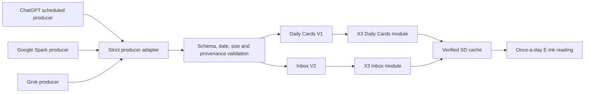
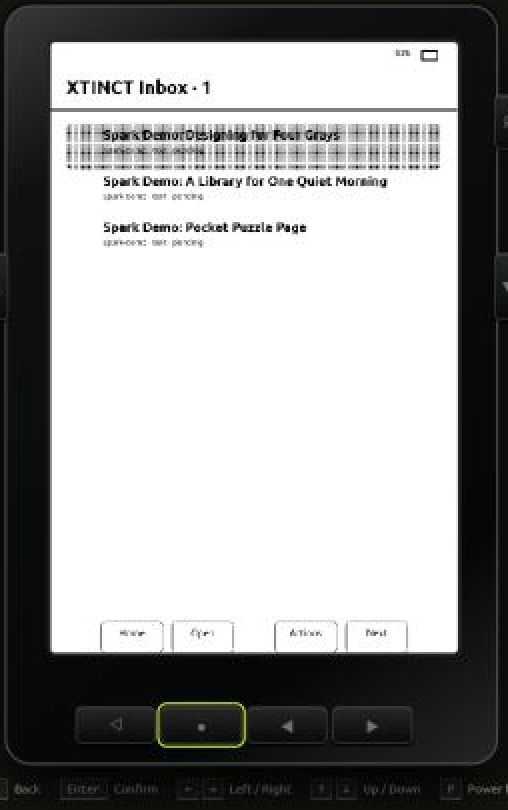
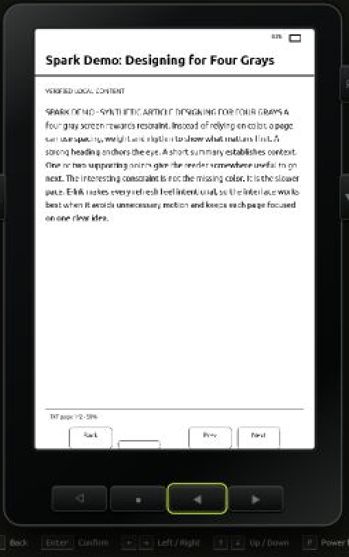

# How we extended CrossPoint with AI-fed Cards and Inbox modules

This is a sanitized description of an experimental CrossPoint/Xteink X3 modification. It explains the architecture and wire shapes without publishing a real email address, deployment hostname, credential, device identifier, private content, location, schedule, account configuration, or private firmware image.

The examples below use fictitious dates and content. They are intended to show the format and safety boundaries, not to target a live deployment.

## The idea

The goal was to turn a small E-Ink reader into a quiet, once-a-day information surface. A few content producers prepare material while the reader sleeps. A validation service turns accepted material into two deliberately separate feeds:

- **Daily Cards V1** for compact, glanceable status reports with optional full plain-text reports.
- **Inbox V2** for longer text, EPUB, image, action, and sleep-screen artifacts with per-item actions and delivery receipts.

The X3 wakes on a bounded schedule, connects to a saved Wi-Fi network, downloads only new or changed material, verifies it, stores it on microSD, and returns to sleep. Manual refresh remains available, but normal use is designed around checking the device once a day.



The arrows do not mean all three AIs write the same item. The system enforces **one producer for one logical job and date**. Moving a job from one producer to another requires disabling the prior owner so duplicate articles cannot race each other.

## Modeled preview: a Spark-style Inbox V2 feed

The following images come from the public lab's modeled X3 renderer. All titles and article text are fictional demonstration material written for this preview. No live feed, private article, account, device, or physical E-Ink screen appears here.

| Inbox V2 feed | Opened text artifact |
|---|---|
|  |  |

**Evidence label: MODELED / SYNTHETIC.** The first screen shows separate Inbox V2 deliveries. Opening one uses the bounded text-reader path, while the item metadata can still expose server-allowlisted feedback such as `like` and `dislike`. This demonstrates the interface and contract shape, not unattended production delivery or physical display quality.

## How ChatGPT, Spark, and Grok enter the same system

The three producers use different transports, but they converge on the same bounded content contract.

### ChatGPT

A scheduled ChatGPT task creates a complete JSON envelope and sends it as the sole plain-text body of an allowlisted automation email. The subject identifies the job. There is no greeting, Markdown fence, attachment, excerpt, or instruction outside the JSON object.

### Google Spark

Spark can generate the same envelope through a constrained Tasks relay. A deployment may alternatively use a narrowly scoped draft handoff when its mail permissions support that path. Spark does not receive a general-purpose publishing credential, and the relay cannot select arbitrary commands or device operations.

### Grok

Grok uses an isolated, write-only MCP publishing tool. It submits a known job plus the same validated payload shape. It does not receive inbox-read, device-management, or general Worker administration access. A truncated notification email is never treated as the content artifact.

The transport is therefore replaceable; the acceptance rules are not. Every producer must supply complete renderer-safe content, a known job, a run identity, a matching local date, and any required public-source provenance. On failure, the prior committed item remains in place. The bridge does not publish partial output or invent missing text.

## The common automation envelope

An automation message has an exact allowlisted subject whose general form is:

```text
XTINCT AUTOMATION — <ALLOWLISTED MODULE>
```

Its plain-text MIME body is exactly one JSON object. This sanitized example uses a deliberately non-live date and contains no personal or access-bearing identifier:

```json
{
  "schema": "xtinct.automation-content-email/v1",
  "job": "daily-puzzle-page",
  "run_id": "daily-puzzle-page/2099-01-01",
  "content": {
    "title": "The Quiet Page - Demonstration",
    "summary": "Four small puzzles designed for a slow E-Ink break.",
    "points": [
      "Logic, words, sequence and observation",
      "Hints and answers follow the puzzle page"
    ],
    "body": "The Quiet Page - Demonstration\n\nPUZZLES\n\nONE - THE THREE BOXES\n\nThree closed boxes are labelled APPLES, PEARS, and MIXED. Every label is wrong. You may take one piece of fruit from one box without looking inside. Which box should you sample, and how can that single fruit let you label all three boxes correctly? Write the three labels before checking the hints.\n\nTWO - LETTER STEPS\n\nChange one letter at a time to turn COLD into WARM. Every intermediate step must be an ordinary English word, and you must keep four letters at every step. Try to do it in no more than five changes. A valid route matters more than finding the only route.\n\nTHREE - THE PATTERN\n\nWhat number comes next: 2, 3, 5, 9, 17, 33? Explain the rule in a short sentence. Then invent the next two terms so another reader could verify that your rule remains consistent.\n\nFOUR - WINDOW WATCH\n\nLook away from this page for twenty seconds. Without moving from your seat, notice one repeated shape, one source of reflected light, and one object whose purpose is not obvious from its silhouette. Return to the page and describe each in five words or fewer.\n\nHINTS\n\nONE - Because every label is wrong, the box marked MIXED cannot contain mixed fruit. The single fruit drawn from that box identifies its entire contents. The two remaining labels then follow by elimination.\n\nTWO - It can help to move through words meaning a fastening, a playing card, or physical damage before reaching heat. Several routes are possible; each intermediate spelling must stand alone as a word.\n\nTHREE - Compare each term with the one before it. The increases are 1, 2, 4, 8, and 16.\n\nFOUR - There is no hidden trick. The constraint turns ordinary observation into a compact memory exercise. Specific descriptions are better than poetic ones.\n\nANSWERS\n\nONE - Draw from the box labelled MIXED. If it yields an apple, that box is APPLES. The box labelled PEARS cannot be pears and cannot be apples, so it is MIXED; the final box is PEARS. Reverse apple and pear if the sampled fruit is a pear.\n\nTWO - One possible route is COLD, CORD, CARD, WARD, WARM. Other valid word ladders also count.\n\nTHREE - Each new term is twice the previous term minus one. The next values are 65 and 129.\n\nFOUR - Your three observations are the answer. Keep them only if each description identifies a real visible detail rather than a category such as thing or object.",
    "sources": []
  }
}
```

For this envelope family:

- `schema`, `job`, `run_id`, and `content` are the only top-level keys.
- `run_id` is `<job-id>/YYYY-MM-DD`, and the date must match the message or relay date in the configured local timezone.
- `title` is at most 120 UTF-8 bytes.
- `summary` is one line and at most 144 UTF-8 bytes.
- `points` contains one or two distinct one-line entries, each at most 64 UTF-8 bytes.
- `body` is plain text, begins with the exact title, uses the module's required uppercase headings separated by blank lines, contains no HTML or Markdown, and is at most 64 KiB.
- Original fiction and puzzle modules use `sources: []`. Research modules require bounded, unique public HTTPS sources and repeat each source name and URL under a final `SOURCE NOTES` heading.
- The producer cannot choose firmware commands, arbitrary URLs to fetch, device targets, item IDs, revisions, hashes, or executable actions.

The Worker validates the complete object before creating anything device-visible. For generated originals, actions such as `like` and `dislike` are assigned from the server's module registry, not trusted from the producer payload.

## Daily Cards V1

Daily Cards is the compact dashboard lane. It is intentionally separate from Inbox: a V1 card is never copied or summarized into V2 simply to increase the item count.

A producer atomically commits three values to its reserved handoff row:

```text
[run_id, minified_payload_json, identical_run_id]
```

Matching outer run IDs act as a small commit fence. The importer ignores incomplete or conflicting rows and leaves the previous good card available. This is a sanitized, deliberately non-runnable card example. The placeholder task ID must be replaced by a privately configured allowlisted ID before validation:

```json
{
  "task_id": "example-card-task",
  "run_id": "example-card-task/demo-2099-01-01",
  "generated_at": "2099-01-01T06:00:00+00:00",
  "expires_at": "2099-01-04T06:00:00+00:00",
  "title": "Daily Briefing - DEMO",
  "summary": "CADENCE: PRIVATE SCHEDULE — Example-only status snapshot.",
  "priority": 1,
  "state": "ok",
  "metrics": [
    { "label": "CADENCE", "value": "PRIVATE SCHEDULE", "tone": "neutral" },
    { "label": "SIGNAL", "value": "DEMO ONLY", "tone": "neutral" }
  ],
  "sections": [
    {
      "heading": "OVERVIEW",
      "lines": [
        "A fictitious market moved within a narrow range.",
        "No real holding, price or recommendation is shown."
      ]
    },
    {
      "heading": "NEXT CHECK",
      "lines": ["Review the complete report after the next scheduled run."]
    }
  ],
  "actions": [],
  "body": "Daily Briefing - DEMO\n1 January 2099\nCADENCE: PRIVATE SCHEDULE\n\nOVERVIEW\n\nThis is fictitious renderer-safe report text. It contains no real account, holding, price, source payload or recommendation.\n\nNEXT CHECK\n\nWait for the next complete validated report.",
  "source_url": "https://example.com/reference",
  "image_url": null
}
```

The current card contract allows:

- an 80-byte title and 320-byte summary;
- up to four metrics;
- up to three sections with four lines per section;
- lines of at most 240 UTF-8 bytes;
- priority `0` through `3` and state `ok`, `empty`, `attention`, or `error`;
- no producer-supplied actions in this release; and
- an optional complete plain-text report of at most 24 KiB with no NUL characters.

The Worker, not the producer, creates the card revision and any authenticated report descriptor. On the X3, the manifest is fetched with ETag support. A `304 Not Modified` is accepted only if every referenced cached card and report still validates. Changed reports stream to hidden revisioned files, and exact byte count plus SHA-256 must pass before atomic promotion.

The device UI presents Back, Refresh, Open, and Next. Opening a full report borrows the text reader without adding it to Recent Books or disturbing the reader's normal book-resume state.

## Inbox V2

Inbox is the artifact lane. The fixed renderer vocabulary is:

```text
card | text | image-1bit | epub | action | sleep-screen
```

An accepted producer envelope is converted into a server-owned delivery. A simplified delivery shape looks like this:

```json
{
  "delivery_id": "demo-delivery-1",
  "item_id": "demo-item-1",
  "module_id": "daily-puzzle-page",
  "kind": "text",
  "title": "The Quiet Page - Demonstration",
  "revision": "aaaaaaaaaaaaaaaaaaaaaaaaaaaaaaaaaaaaaaaaaaaaaaaaaaaaaaaaaaaaaaaa",
  "sha256": "bbbbbbbbbbbbbbbbbbbbbbbbbbbbbbbbbbbbbbbbbbbbbbbbbbbbbbbbbbbbbbbb",
  "bytes": 1234,
  "mime": "text/plain; charset=utf-8",
  "created_at": "2099-01-01T06:00:00+00:00",
  "expires_at": null,
  "actions": ["like", "dislike"],
  "metadata": {
    "schema": "xtinct.automation-content-email/v1",
    "job": "daily-puzzle-page",
    "content_mode": "original-puzzles",
    "digest": {
      "schema": "xtinct.inbox-digest/v1",
      "summary": "Four small puzzles designed for a slow E-Ink break.",
      "points": [
        "Logic, words, sequence and observation",
        "Hints and answers follow the puzzle page"
      ]
    }
  }
}
```

The IDs, revision, digest, byte count, SHA-256, module, actions, timestamps, and device routing shown in a real delivery are derived or constrained by the server. The repeated characters above are illustrative placeholders, not hashes for the example text.

The X3 requests cursor-ordered pages of at most 16 changes. It downloads artifacts from the same authenticated origin, rejects redirects, streams large objects instead of buffering them whole, and verifies exact bytes and SHA-256 before committing. Tombstones remove recalled items. Failed or interrupted transfers preserve the last committed state and do not silently advance the cursor.

Inbox actions are bounded data, not remote code. Depending on item kind and module, the registry may expose `keep`, `archive`, `done`, `defer`, `open-phone`, `like`, or `dislike`. Device receipts are queued in a bounded outbox and retried idempotently. A local delete is never blocked just because the network or receipt queue is unavailable.

## Implemented content modules

This is an inventory of content already represented by concrete XTINCT producer contracts, strict Worker validation/publication paths, and the compatible X3 client flows. It is not a brainstorm for possible future Cards or Inbox uses. Names that could disclose personal context are generalized here, while the functional distinctions are preserved.

### Inbox V2 modules

| Implemented module | What it already produces | Implemented actions |
|---|---|---|
| Reader Genome batch | Exactly three distinct, source-backed long-form articles selected across business, design and architecture, custom hardware and E-Ink, and 3D/VFX domains | `like` / `dislike` |
| E-Ink Serial | One original 800-1,200-word fiction installment with recap, episode, and deliberate stopping point | `like` / `dislike` |
| Daily Puzzle | One original page of three to five puzzles followed by non-spoiling hints and complete answers | `like` / `dislike` |
| Project Watchlist | A verified status brief covering selected software projects, changes, risks, and next actions | `keep` / `archive` / `open-phone` |
| Business Opportunities | A source-backed brief separating concrete opportunities from speculation and covering fit, cost, effort, and next actions | `keep` / `archive` / `open-phone` |
| Hardware Research | A source-backed compatibility brief for firmware, libraries, tools, resource budgets, risks, and physical-test limits | `keep` / `archive` / `open-phone` |
| Weekend City Guide | A source-backed guide to current events and practical planning details, presented under a generalized public name | `keep` / `archive` / `open-phone` |

The Reader Genome importer commits its three siblings atomically. The two original-content modules reject external sources and expose feedback actions assigned by the Worker. The four research modules require bounded public HTTPS provenance and end with renderer-safe source notes.

### Daily Cards V1 modules

| Implemented card | What it already summarizes |
|---|---|
| Market Briefing | A compact market-status card with cadence, metrics, short sections, and an optional complete report |
| Weekday Opportunity Scan | Current freelance opportunities, source coverage, and the most useful next check |
| Weekly 3D Job Search | A clearly weekly 3D-role scan with its cadence visible on the card and in the report |
| Attention Watch | Newly arrived messages that genuinely require same-day human handling, without copying private message bodies onto the X3 |

All four Cards are retained independently, use an atomic three-cell producer fence, and can expose a verified revisioned plain-text report. They deliberately have no producer-supplied device actions in the current release and are never mirrored into Inbox V2.

### Today and Radar V2 edition

The implemented Today path composes one structured, single-spine EPUB from the sections that are meaningful on that day: a restricted current-day calendar digest; normalized deadlines and significant plans; a commitment-review companion; outstanding V2 actions; recent proof; daily learning; and status diagnostics. Source failures are isolated so one missing section does not suppress unrelated content, and V1 market or attention reports never leak into the Today edition.

### Implementation and feedback boundary

Here, **implemented** means the compatible source has a fixed job or section contract, schema validation, bounded publication and recovery behavior, Worker-owned identifiers and hashes, and device-facing renderer/client support with tests. It does not mean every producer has completed a later unattended run or that every item has been opened on a physical X3.

The X3-to-Worker `like` and `dislike` receipt path and a bounded feedback-profile builder exist for E-Ink Serial and Daily Puzzle. That profile is not yet injected into the scheduled generators, so the system must not claim that a new story or puzzle has already adapted to those preferences. Producer ownership can move between supported AI transports, but the content contracts and one-producer-per-job/date rule stay fixed.

## What changed in the CrossPoint firmware

The firmware work keeps CrossPoint as the reading and hardware foundation, then adds:

- Daily Cards and Inbox destinations in the X3 navigation model;
- daily wake, saved-network connection, NTP refresh, and bounded retry behavior;
- strict TLS verification for the private feed;
- revision-aware manifests, ETag validation, and cache-first operation;
- streaming report and artifact downloads with byte/SHA verification;
- atomic SD promotion and recovery behavior for interrupted writes;
- cursor paging, tombstones, actions, and receipt/outbox retry;
- renderer-safe TXT and EPUB paths for feed artifacts;
- a phone-assisted Wi-Fi and schedule setup flow; and
- recovery and privacy hardening so credentials are not written into SD caches or crash reports.

The content service never sends executable modules to the reader. New Inbox modules are combinations of a fixed renderer kind, validated metadata, an immutable artifact, and allowlisted actions.

## Failure behavior matters more than the happy path

This design treats a failed refresh as a reason to preserve the last known-good content, not to empty the reader. Examples include:

- malformed producer JSON: reject before publication;
- incomplete atomic handoff: keep the previous card;
- duplicate job/date: converge idempotently rather than publish twice;
- invalid source or off-schedule date: reject the entire item;
- short artifact or wrong hash: discard staging and keep the old artifact;
- interrupted Inbox page: retain the committed prefix and resume safely;
- acknowledgement failure: retain the exact outbox prefix for retry; and
- no network: open verified cached content and report the refresh failure visibly.

The emulator's synthetic Cards V1 and Inbox V2 scenarios exist largely to make these cases repeatable before hardware testing.

## Limits and evidence boundary

This architecture description is not a claim that every producer is currently active or that every unattended run has reached a physical X3. Configuration, producer transport, Worker acceptance, feed visibility, device sync, and device opening are separate evidence stages.

The browser lab can test modeled navigation and bounded HTTP contracts. It cannot prove real E-Ink waveform or ghosting, physical button timing, microSD brownout behavior, Wi-Fi/Bluetooth radio behavior, RTC wake, fragmented heap, watchdog timing, or battery use. Those remain physical-device checks against an exact firmware build.

Likewise, the examples above do not reveal or grant access to the real system. They contain no deployment address, mailbox, authorization data, device token, private source, personal content, or usable production identifier.

## Why this is useful

The result is less like a general-purpose tablet and more like a private printed packet that quietly replaces itself. Different models can research, write, or summarize in the environment where each is strongest, but none gets to invent the delivery protocol or command the device. The narrow contracts make the small reader viable: the server does expensive validation and transformation, while the X3 performs bounded paging, streaming, verification, caching, rendering, and sleep.

For a device checked once a day, that separation is the feature.
